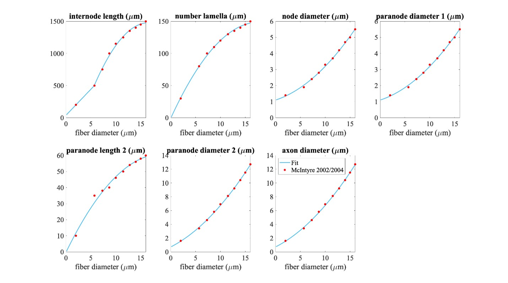
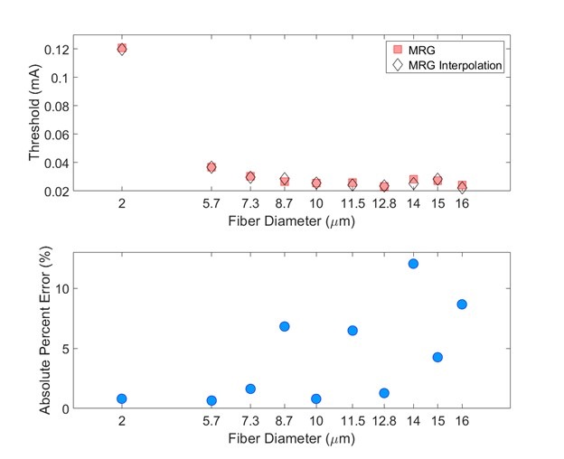

# S21: Implementation of NEURON fiber models
- [1.1 Myelinated fiber models](https://github.com/wmglab-duke/ascent/wiki/S21:-Implementation-of-NEURON-fiber-models#11-myelinated-fiber-models)
  - [1.1.1 MRG discrete diameter](https://github.com/wmglab-duke/ascent/wiki/S21:-Implementation-of-NEURON-fiber-models#111-mrg-discrete-diameter-as-previously-published)
  - [1.1.2 MRG interpolated diameters](https://github.com/wmglab-duke/ascent/wiki/S21:-Implementation-of-NEURON-fiber-models#112-mrg-interpolated-diameters)
- [1.2 Unmyelinated Fiber Models](https://github.com/wmglab-duke/ascent/wiki/S21:-Implementation-of-NEURON-fiber-models#12-unmyelinated-fiber-models)
- [1.3 References](https://github.com/wmglab-duke/ascent/wiki/S21:-Implementation-of-NEURON-fiber-models#13-references)

## 1.1 Myelinated fiber models

The `CreateAxon_Myel.hoc` file is loaded in `Wrapper.hoc` if the user
chooses either `“MRG_DISCRETE”` or `“MRG_INTERPOLATION”`. The length of
each section in NEURON varies depending on both the diameter and the
“FiberGeometry” mode chosen in ***Sim***.

### 1.1.1 MRG discrete diameter (as previously published)

The “FiberGeometry” mode `“MRG_DISCRETE”` in ***Sim*** instructs the
program to simulate a double cable structure for mammalian myelinated
fibers \[1,2\]. In the pipeline, we refer to this model as
`“MRG_DISCRETE”` since the model’s geometric parameters were originally
published for a *discrete* list of fiber diameters: 1, 2, 5.7, 7.3, 8.7,
10, 11.5, 12.8, 14.0, 15.0, and 16.0 μm. Since the MRG fiber model has
distinct geometric dimensions for each fiber diameter, the parameters
are stored in `config/system/fiber_z.json` as lists in the
`“MRG_DISCRETE”` JSON Object, where a value’s index corresponds to
the index of the discrete diameter in “diameters”. The parameters are
used by the Fiberset class to create `fibersets/` (i.e., coordinates to
probe `potentials/` from COMSOL) for MRG fibers.

### 1.1.2 MRG interpolated diameters

The “FiberGeometry” mode `“MRG_INTERPOLATION”` in ***Sim*** instructs the
program to simulate a double cable structure for mammalian myelinated
fibers for any diameter fiber between 2 and 16 µm (throws an error if
not in this range) by using an *interpolation* over the originally
published fiber geometries \[1,2\]. In the pipeline, we refer to
this model as `“MRG_INTERPOLATION”` since it enables the user to simulate
any fiber diameter between the originally published diameters.

The parameters in the `“MRG_INTERPOLATION”` JSON Object in
`config/system/fiber_z.json` are used by the Fiberset class to create
`fibersets/` (i.e., coordinates at which to sample `potentials/` from
COMSOL) for interpolated MRG fibers. Since the parameter values relate
to fiber “diameter” as a continuous variable, the expressions for all
the dimensions that change with fiber diameter, as shown in Figure A, are stored as a String
that is computed using Python’s built-in `“eval()”` function.

Figure A. Piecewise polynomial fits to published MRG fiber parameters. Single quadratic fits were used for all parameters except for internode length, which has a linear fit below 5.643 µm (using MRG data at 2 and 5.7 µm) and a single quadratic fit at diameters greater than or equal to 5.643 µm (using MRG data >= 5.7 µm); 5.643 µm is the fiber diameter at which the linear and quadratic fits intersected. The fiber diameter is the diameter of the myelin. “Paranode 1” is the MYSA section, “paranode 2” is the FLUT section, and “internode” is the STIN section. The axon diameter is the same for the node of Ranvier and MYSA (“node diameter”), as well as for the FLUT and STIN (“axon diameter”). The node and MYSA lengths are fixed at 1 and 3 μm, respectively, for all fiber diameters.

We compared fiber activation thresholds between the originally published
MRG fiber models and the interpolated MRG ultrastructure (evaluated at
the original diameters) at a single location in a rat cervical vagus
nerve stimulated with the bipolar Purdue cuff. Each fiber was placed at
the centroid of the best-fit ellipse of the monofascicular nerve sample.
The waveform was a single biphasic pulse using
`“BIPHASIC_PULSE_TRAIN_Q_BALANCED_UNEVEN_PW”` with 100 µs for the
first phase, 100 µs interphase (0 mA), and 400 µs for the second phase
(cathodic/anodic at one contact and anodic/cathodic at the other
contact). The thresholds between the originally published models and the
interpolation of the MRG fiber diameters are compared in Figure B below.
The threshold values were determined using a binary search until the
upper and lower bound stimulation amplitudes were within 1%.

Figure B. Comparison of thresholds between the originally published models and the interpolation of the MRG fiber diameters (evaluated at the original diameters). Thresholds are expected to vary between the originally published models and the interpolated fiber geometries given their slightly different ultrastructure parameters (Figure A). Used original MRG thresholds as reference.

## 1.2 Unmyelinated Fiber Models

The pipeline includes several unmyelinated (i.e., C-fiber) models
\[3-5\]. Users should be aware of the `“delta_zs”` parameter that
they are using in `config/system/fiber_z.json`, which controls the
spatial discretization of the fiber (i.e., the length of each section).

## 1.3 References
1. McIntyre CC, Grill WM, Sherman DL, Thakor N V. Cellular effects of deep brain stimulation: model-based analysis of activation and  inhibition. J Neurophysiol. 2004 Apr;91(4):1457–69.
2. 	McIntyre CC, Richardson AG, Grill WM. Modeling the excitability of mammalian nerve fibers: influence of afterpotentials on the recovery cycle. J Neurophysiol. 2002 Feb;87(2):995–1006.
3. 	Sundt D, Gamper N, Jaffe DB. Spike propagation through the dorsal root ganglia in an unmyelinated sensory neuron: a modeling study. J Neurophysiol. 2015 Dec;114(6):3140–53.
4. 	Tigerholm J, Petersson ME, Obreja O, Lampert A, Carr R, Schmelz M, et al. Modeling activity-dependent changes of axonal spike conduction in primary afferent C-nociceptors. J Neurophysiol. 2014 May;111(9):1721–35.
5. 	Rattay F, Aberham M. Modeling axon membranes for functional electrical stimulation. IEEE Trans Biomed Eng. 1993 Dec;40(12):1201–9.
