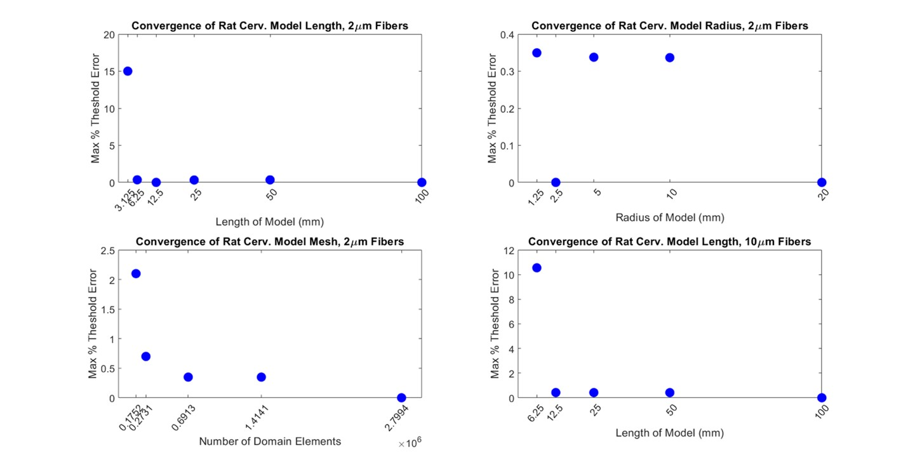

# S34: Convergence analysis example
## Convergence analysis example

\*Note: The following convergence analysis was performed for a rat
cervical vagus nerve and is provided as an illustrative example.

The outer boundaries of the model (assigned to electrical ground) were
initially set to dimensions that are known to be excessively large in
both length (100 mm) and radius (20 mm) (Figure A). For testing of
convergence of the model length and diameter, we carefully controlled
the mesh parameters such that any changes in the threshold to excite
model nerve fibers positioned in the finite element model are attributed
to changes in model dimensions and not to a change in mesh density.
First, we used an excessive number of domain mesh elements. Second, to
maintain consistent meshing in the area of interest despite a change in
geometry of the outer boundary of the model, the proximal region of the
model surrounding the nerve and electrode (i.e., “proximal”, which is
the full length of the nerve) was assigned its own mesh entirely
independent from the outer boundary region (i.e., “distal”).

Figure A. Convergence of FEM model dimensions and mesh density for 2 and 10 μm myelinated MRG fibers modeled in a rat cervical vagus nerve.

For different model sizes and mesh densities, we determined excitation
thresholds for 100 randomly placed 2 µm diameter myelinated model axons
in the nerve. First, with the radius of the model held constant at 20
mm, we halved the length of the model until there was a change in
threshold of greater than 2% compared to the 100 mm-long model. The
resulting length of the model was chosen to be 6.25 mm, as the next
shortest length (3.125 mm) had at least one fiber with a threshold
change of 15%, which was above our tolerance of 2%. Second, with the
length of the model held constant at 6.25 mm, the radius of the model
was halved until there was a change in threshold of greater than 2%
compared to the 20 mm-radius model. The resulting radius of the model
was chosen to be 1.25 mm. The radius of the model could not be reduced
further without interfering with the electrode geometry. We then reduced
the number of mesh elements until there was a 2% change in thresholds
for activation of model nerve fibers. Meshing parameters that resulted
in \~273,000 domain elements for the 1.25 mm radius and 6.25 mm length
model were chosen for further studies.

Lastly, the length was again converged with 10 µm diameter myelinated
model axons using the previously found model radius and mesh density to
ensure that the model length incorporated enough nodes
of Ranvier for convergence of threshold for all native fiber diameters.
A conservative estimate for the largest myelinated fiber diameter found
in the cervical level of a rat vagus nerve is 10 µm \[1\]. The largest
diameter nerve fiber native to this region is of interest in our
convergence studies because it will have the fewest number of nodes per
unit length (based on INL=100\*D). We found that the FEM length needed
to be longer for 10 µm diameter myelinated fibers (12.5 mm) than 2 µm
diameter myelinated fibers (6.25 mm).

## References
1. Licursi de Alcântara AC, Salgado HC, Sassoli Fazan VP. Morphology and morphometry of the vagus nerve in male and female spontaneously  hypertensive rats. Brain Res. 2008 Mar;1197:170–80. Available from: [https://doi.org/10.1016/j.brainres.2007.12.045](https://doi.org/10.1016/j.brainres.2007.12.045)
